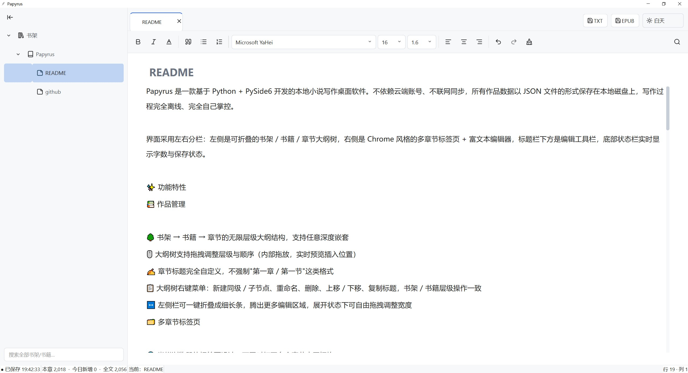
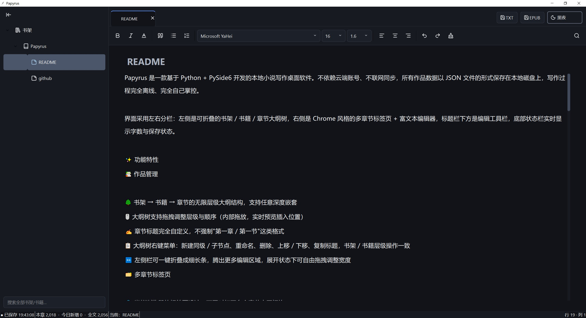
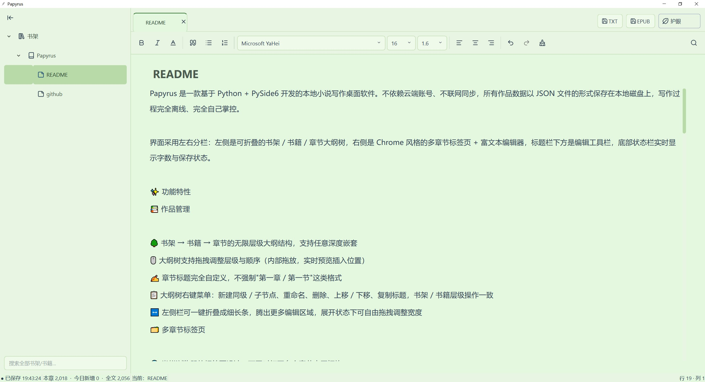

<div align="center">


# Papyrus

**本地小说写作桌面软件 · Local Novel Writing Desktop Application**

**Version 0.8.7.3**

[简体中文](#简体中文) ｜ [English](#english)

</div>

---

# 简体中文

Papyrus 是一款面向小说、长篇写作与个人创作的本地桌面写作软件。

它采用 **Python + PySide6** 构建，不需要云端账号，也不依赖在线同步。作品数据保存在本地磁盘，适合希望将小说完全掌握在自己手中的作者。

Papyrus 的设计重点不是复杂的办公功能，而是提供一个安静、清晰、适合长期写作的创作环境。

---

## 🖥️ 软件界面

### ☀️ 白天模式



### 🌙 黑夜模式



### 🌿 护眼模式



---

## ✨ 功能特性

### 📚 多作品与大纲管理

Papyrus 使用层级化的大纲结构组织小说内容。

- 支持多个书架、书籍以及章节节点
- 大纲节点支持无限层级嵌套
- 可以自由编写节点标题
- 不强制使用"第一章 / 第一节"等固定命名
- 支持创建同级节点
- 支持创建子节点
- 支持重命名
- 支持删除
- 支持同级节点上移 / 下移
- 支持拖拽调整节点顺序与层级
- 大纲结构可以随着小说实际结构自由调整
- 书架、书籍和章节均支持相应的右键操作

---

### 🗂️ 多章节标签页

Papyrus 支持同时打开多个章节。

- 多章节标签页
- 标签页可以自由切换
- 标签页支持拖拽调整顺序
- 每个标签页可以独立关闭
- 删除对应章节时，会自动处理相关打开的标签页
- 适合同时参考多个章节进行写作

---

### ✍️ 富文本写作编辑器

Papyrus 使用 Qt 富文本编辑器作为正文编辑区域。

支持：

- **加粗**
- *斜体*
- <u>下划线</u>
- 引用块
- 无序列表
- 有序列表
- 左对齐
- 居中
- 右对齐
- 清除字符格式
- 自定义字体
- 自定义字号
- 自定义行高
- 自定义段落间距

编辑器中的正文格式会随作品数据一起保存。

---

### 📝 自由章节标题

Papyrus 不强制规定章节名称。

你可以直接写：

```text
第一章 
```

也可以写：

```text
开篇
```

或者：

```text
Part I
```

章节名称完全由作者决定。

如果启用自动编号，编号只是界面中的辅助显示，不会修改你实际写下的标题。

---

### 🔢 自动章节编号

支持自动生成层级编号。

可以根据大纲层级显示类似：

```text
1
1.1
1.1.1
```

或者章节层级编号。

编号用于帮助作者理解当前大纲结构，不会覆盖原始节点标题。

---

### 🎨 三种主题

Papyrus 内置三套完整主题：

- ☀️ 白天
- 🌙 黑夜
- 🌿 护眼

主题会同步影响：

- 主界面
- 侧边栏
- 大纲树
- 标签页
- 工具栏
- 编辑器
- 输入框
- 下拉框
- 状态栏
- 滚动条
- 图标颜色

护眼模式采用柔和的低饱和绿色配色，减少长时间写作时的视觉刺激。

---

### 🔍 全局搜索

Papyrus 提供跨作品的全局搜索。

可以搜索：

- 书架名称
- 书籍名称
- 章节标题
- 正文内容

搜索结果会显示：

```text
作品
└─ 大纲路径
   └─ 匹配内容预览
```

双击搜索结果即可跳转到对应章节。

---

### 📊 写作统计

底部状态栏实时显示写作统计。

包括：

- 当前章节字数
- 当前作品全文字数
- 今日新增字数
- 当前保存状态

字数统计基于正文实际内容计算，而不是简单统计 HTML 标签。

"今日新增字数"按照当前写作会话中的实际增长计算，不会因为打开旧稿而把历史正文重复计入今日写作量。

---

### 💾 自动保存

Papyrus 不要求作者频繁手动点击保存。

正文发生修改后，会自动进入保存流程。

保存状态会实时显示，例如：

```text
● 已保存 21:35:42
```

或者：

```text
● 未保存
```

如果发生保存错误，也会显示相应状态。

关闭程序时也会自动保存当前内容。

---

### 📐 写作排版

Papyrus 提供针对长篇写作优化的排版控制。

可以调整：

- 正文字号
- 行高
- 段落间距
- 正文区域宽度
- 编辑器字体

默认采用适合 Windows 中文环境的字体配置，并支持从本机字体列表中选择字体。

---

### 📋 中文化右键菜单

正文编辑器提供重新设计的右键菜单。

包括：

- 撤销
- 重做
- 剪切
- 复制
- 粘贴
- 粘贴且不使用任何格式
- 全选

避免从网页或其他软件复制文本时把原来的字体、颜色和背景格式带入正文。

---

### 📤 导出

Papyrus 支持将作品导出为：

**TXT**

按照大纲结构组织正文，并根据节点层级进行缩进。

适合：

- 纯文本备份
- 发布前整理
- 发送给其他编辑器
- 长期归档

**EPUB**

支持生成标准 EPUB 电子书结构。

章节按照大纲结构组织，并生成电子书导航。

适合进一步在支持 EPUB 的阅读器中阅读。

---

### 💾 数据存储

Papyrus 采用本地数据存储。

程序运行后会自动创建：

```text
novel_data.json
```

以及：

```text
novel_data/
```

作品索引与各作品正文数据分别保存，避免所有小说内容长期堆积在一个巨大 JSON 文件中。

写作内容不会自动上传到服务器。

因此：

> Papyrus 不负责云端备份。

如果小说非常重要，建议作者自行定期备份 `novel_data.json` 和 `novel_data/`。

---

### 🔒 隐私

Papyrus 是本地写作软件。

你的小说正文、章节结构以及写作数据默认保存在本机。

项目仓库不会主动包含运行过程中产生的：

- `novel_data.json`
- `novel_data/`

因此不应该将个人小说正文提交到 GitHub 仓库。

---

## 🖥️ 运行环境

### Windows 便携版

普通用户无需安装 Python。

下载 Release 中提供的：

```text
Papyrus_0.8.7.3.zip
```

解压后运行：

```text
Papyrus.exe
```

即可。

### 🚀 从源码运行

如果你希望直接运行 Python 源码：

```bash
git clone https://github.com/euclase2333/Papyrus.git
cd Papyrus
pip install PySide6
python Papyrus_0.8.7.3.py
```

---

## 📦 项目结构

```
Papyrus/
│
├─ Papyrus_0.8.7.3.py       # Papyrus 主程序
├─ ui_icons.py              # SVG 图标管理
├─ Papyrus.spec             # PyInstaller 打包配置
│
├─ assets/
│  ├─ LOGO.png              # Papyrus Logo
│  │
│  └─ icons/                # 界面 SVG 图标
│     ├─ bold.svg
│     ├─ italic.svg
│     ├─ underline.svg
│     ├─ quote.svg
│     ├─ list.svg
│     ├─ list-ordered.svg
│     └─ ...
│
├─ screenshots/
│  ├─ theme-day.png         # 白天模式截图
│  ├─ theme-night.png       # 黑夜模式截图
│  └─ theme-eye-care.png    # 护眼模式截图
│
├─ History/                 # 开发历史版本
│
├─ novel_data/              # 运行后自动生成
└─ novel_data.json          # 运行后自动生成
```

---

## 🛠️ 自行打包

Papyrus 可以使用 PyInstaller 打包为 Windows 便携版程序。

安装：

```bash
pip install pyinstaller
```

然后根据项目中的 `.spec` 文件进行打包：

```bash
pyinstaller Papyrus.spec
```

打包完成后，将必要的 `assets/` 等资源文件与生成的 EXE 保持正确的相对路径，即可得到便携式发行版本。

---

## 📥 下载

普通 Windows 用户无需安装 Python。

请前往 GitHub Releases：

**https://github.com/euclase2333/Papyrus/releases**

下载最新版本的：

```text
Papyrus_0.8.7.3.zip
```

解压后双击：

```text
Papyrus.exe
```

即可运行。

---

<div align="center">

Papyrus · Write your story.

</div>

<details>
<summary><h1 id="english">English</h1></summary>

# Papyrus

**Local Novel Writing Desktop Application**

**Version 0.8.7.3**

Papyrus is a local desktop writing application designed for novels, long-form writing, and personal creative work.

Built with **Python + PySide6**, Papyrus does not require a cloud account or online synchronization. Your writing data is stored locally on your computer.

The goal is simple: provide a quiet, clean and comfortable environment for long-form writing.

---

## 🖥️ Interface

### ☀️ Day Theme


### 🌙 Night Theme


### 🌿 Eye-care Theme


---

## ✨ Features

### 📚 Multi-Work & Outline Management

Papyrus uses a hierarchical outline system to organize writing projects.

- Multiple bookshelves and books
- Unlimited outline nesting
- Fully customizable node titles
- No forced "Chapter 1 / Section 1" naming scheme
- Create sibling nodes
- Create child nodes
- Rename nodes
- Delete nodes
- Move nodes up and down
- Drag and drop to reorder and re-nest nodes
- Context menus for outline management
- Flexible structure for novels of different formats

---

### 🗂️ Multi-Chapter Tabs

Papyrus supports opening multiple chapters simultaneously.

- Multiple chapter tabs
- Quick switching between chapters
- Reorderable tabs
- Individual tab closing
- Automatic handling of tabs when related chapters are deleted

---

### ✍️ Rich Text Editor

Papyrus provides a Qt-based rich text editor.

Supported formatting includes:

- **Bold**
- *Italic*
- <u>Underline</u>
- Blockquote
- Bullet lists
- Numbered lists
- Left alignment
- Center alignment
- Right alignment
- Clear character formatting
- Custom font family
- Custom font size
- Custom line height
- Custom paragraph spacing

Formatting is stored together with your writing data.

---

### 📝 Fully Custom Chapter Titles

Papyrus does not force a predefined chapter naming convention.

You can write:

```text
Chapter One
```

or:

```text
Prologue
```

or:

```text
Part I
```


Your chapter titles are entirely up to you.

Automatic numbering is only a visual aid and does not overwrite your original titles.

---

### 🔢 Automatic Outline Numbering

Papyrus can display hierarchical numbering such as:

```text
1
1.1
1.1.1
```

The numbering helps visualize the structure of your manuscript without modifying the actual node titles.

---

### 🎨 Three Themes

Papyrus includes three complete themes:

- ☀️ Day
- 🌙 Night
- 🌿 Eye-care Green

The active theme is applied throughout the interface, including:

- Sidebar
- Outline tree
- Tabs
- Toolbar
- Editor
- Inputs
- Combo boxes
- Status bar
- Scrollbars
- Icons

---

### 🔍 Global Search

Search across your entire writing library.

Searchable content includes:

- Bookshelf names
- Book names
- Chapter titles
- Body text

Search results show the relevant book, outline path and matching preview.

Double-click a result to jump directly to the corresponding chapter.

---

### 📊 Writing Statistics

The status bar provides live writing statistics:

- Current chapter word count
- Total book word count
- Today's newly written words
- Save status

Today's writing count is based on actual growth during the current writing session rather than counting previously existing text as new writing.

---

### 💾 Automatic Saving

Papyrus automatically saves your work after changes.

The interface displays the current save state, for example:

```text
● Saved 21:35:42
```

or:

```text
● Unsaved
```

The application also saves the current work when closing.

---

### 📐 Typography

Papyrus provides writing-oriented typography controls.

You can adjust:

- Body font size
- Line height
- Paragraph spacing
- Editor width
- Font family

The default configuration is optimized for Chinese writing on Windows while still supporting other installed fonts.

---

### 📋 Localized Context Menu

The editor provides a customized right-click menu containing:

- Undo
- Redo
- Cut
- Copy
- Paste
- Paste without formatting
- Select all

This makes it easier to copy text from websites or other applications without bringing unwanted formatting into your manuscript.

---

### 📤 Export

Papyrus supports:

**TXT**

Exports your manuscript as structured plain text, preserving the outline hierarchy through indentation.

**EPUB**

Generates a standard EPUB ebook structure with navigation and chapter documents.

---

### 💾 Data Storage

Papyrus stores your writing locally.

The application automatically creates:

```text
novel_data.json
```

and:

```text
novel_data/
```

The project index and individual writing data are stored separately.

This helps keep individual data files manageable and makes backups easier.

---

### 🔒 Privacy

Papyrus is a local-first writing application.

Your manuscript and writing data are stored locally on your computer.

Papyrus does not automatically upload your writing to a server.

For important manuscripts, regular manual backups of `novel_data.json` and `novel_data/` are recommended.

---

## 🖥️ Requirements

### Windows Portable Version

No Python installation is required for the packaged Windows version.

Download:

```text
Papyrus_0.8.7.3.zip
```

Extract it and run:

```text
Papyrus.exe
```

### 🚀 Run from Source

```bash
git clone https://github.com/euclase2333/Papyrus.git
cd Papyrus
pip install PySide6
python Papyrus_0.8.7.3.py
```

---

## 📦 Project Structure

```
Papyrus/
│
├─ Papyrus_0.8.7.3.py
├─ ui_icons.py
├─ Papyrus.spec
│
├─ assets/
│  ├─ LOGO.png
│  └─ icons/
│
├─ screenshots/
│  ├─ theme-day.png
│  ├─ theme-night.png
│  └─ theme-eye-care.png
│
├─ History/
│
├─ novel_data/
└─ novel_data.json
```

---

## 🛠️ Building

Papyrus can be packaged using PyInstaller.

Install:

```bash
pip install pyinstaller
```

Build using the included specification:

```bash
pyinstaller Papyrus.spec
```

Make sure required assets remain available next to the generated executable with the expected relative paths.

---

## 📥 Download

Windows users can download the latest portable release from:

**https://github.com/euclase2333/Papyrus/releases**

Download:

```text
Papyrus_0.8.7.3.zip
```

Extract it and double-click:

```text
Papyrus.exe
```

No Python installation is required.

---

<div align="center">

Papyrus · Write your story.

</div>

</details>
