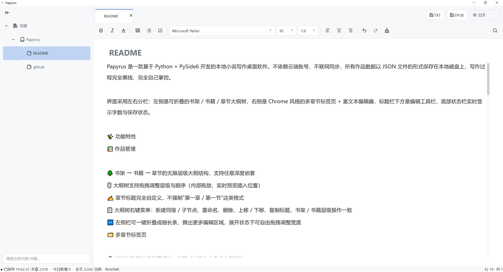
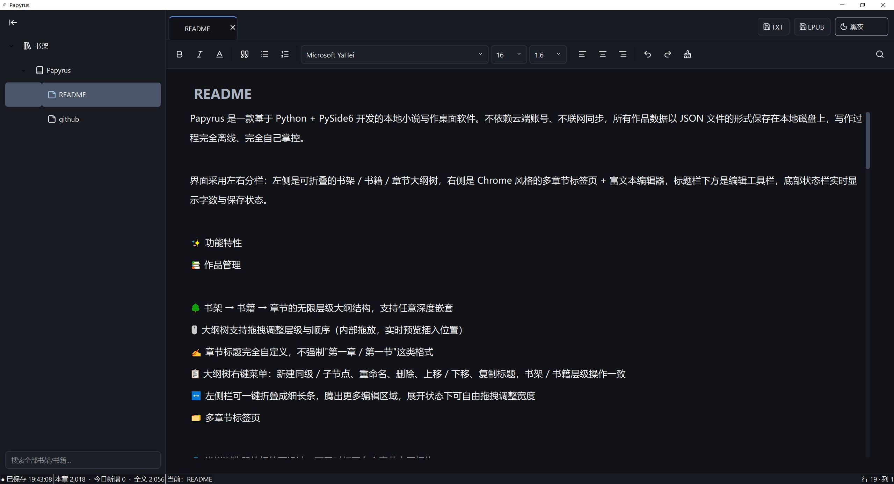
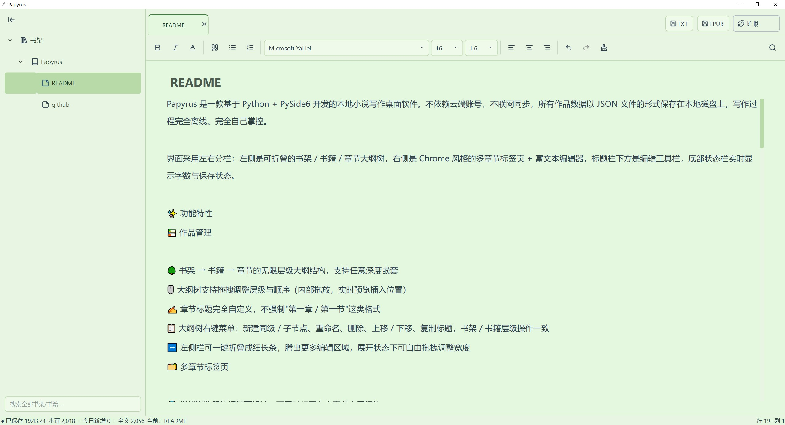

<div align="center">


# Papyrus

**本地小说写作桌面软件 · Local Novel Writing Desktop Application**

[简体中文](#简体中文) ｜ [English](#english)

</div>

---

# 简体中文

Papyrus 是一款面向小说、长篇写作与个人创作的本地桌面写作软件。

它采用 **Python + PySide6** 构建，不需要云端账号，也不依赖在线同步。作品数据保存在本地磁盘，适合希望将小说完全掌握在自己手中的作者。

设计重点不是复杂的办公功能，而是提供一个安静、清晰、适合长期写作的创作环境。

---

## 软件界面

### 白天模式



### 黑夜模式



### 护眼模式



---

## 功能特性

### 多作品与大纲管理

- 多个书架、书籍与章节节点
- 大纲节点支持无限层级嵌套
- 节点标题完全自定义，不强制"第一章"等命名
- 支持创建同级 / 子节点、重命名、删除、上移 / 下移
- 支持拖拽调整顺序与层级
- 书架、书籍、章节均支持右键操作

### 多章节标签页

- 同时打开多个章节，自由切换
- 标签页可拖拽调整顺序，可单独关闭
- 删除章节时自动处理相关标签页

### 富文本编辑器

支持加粗、斜体、下划线、引用块、无序 / 有序列表、左 / 中 / 右对齐、清除格式、自定义字体 / 字号 / 行高 / 段落间距。格式随作品数据一同保存。

### 自由章节标题

章节名称完全由作者决定，可写"第一章""开篇""Part I"等。启用自动编号时，编号仅作为界面辅助显示，不修改原始标题。

### 三种主题

白天、黑夜、护眼绿。主题同步影响主界面、侧边栏、大纲树、标签页、工具栏、编辑器、输入框、下拉框、状态栏、滚动条与图标颜色。

### 全局搜索

可搜索书架名称、书籍名称、章节标题、正文内容。结果按作品与大纲路径显示，双击跳转到对应章节。

### 写作统计

底部状态栏实时显示当前章节字数、当前作品全文字数、今日新增字数、保存状态。"今日新增"按当前写作会话的实际增长计算，不重复计入历史正文。

### 自动保存

正文修改后自动保存，保存状态实时显示。关闭程序时也会自动保存。

### 写作排版

可调整正文字号、行高、段落间距、正文区域宽度与编辑器字体。默认配置适配 Windows 中文环境，也支持从本机字体列表中选择。

### 中文化右键菜单

编辑器右键菜单包含撤销、重做、剪切、复制、粘贴、粘贴且不使用任何格式、全选。避免从网页或其他软件复制文本时带入原有格式。

### 导出

- **TXT**：按大纲结构组织正文，按节点层级缩进
- **EPUB**：生成标准 EPUB 结构，章节按大纲组织，包含电子书导航

### 数据存储

程序运行后自动创建：

```text
novel_data.json
novel_data/
```

作品索引与各作品正文分开保存。写作内容不会自动上传服务器。程序不负责云端备份，重要稿件建议自行备份 `novel_data.json` 和 `novel_data/`。

### 隐私

Papyrus 是本地写作软件，正文、章节结构与写作数据默认保存在本机。项目仓库不包含运行中产生的 `novel_data.json` 与 `novel_data/`，也不应将个人小说正文提交到仓库。

---

## 运行环境

### Windows 便携版

无需安装 Python。下载 Release 中的压缩包，解压后运行 `Papyrus.exe`。

### 从源码运行

```bash
git clone https://github.com/euclase2333/Papyrus.git
cd Papyrus
pip install PySide6
python Papyrus_0.9.0.0.py
```

---

## 项目结构

```text
Papyrus/
│
├─ Papyrus_0.9.0.0.py       # 主入口
├─ config.py                # 常量与配置
├─ models.py                # 数据模型
├─ tree_model.py            # 大纲树模型
├─ widgets.py               # 自定义控件
├─ dialogs.py               # 对话框
├─ html_utils.py            # HTML 处理工具
├─ main_window.py           # 主窗口
├─ ui_icons.py              # SVG 图标管理
│
├─ assets/
│  ├─ LOGO.png
│  └─ icons/
│
├─ screenshots/
│  ├─ theme-day.jpg
│  ├─ theme-night.jpg
│  └─ theme-eye-care.jpg
│
├─ novel_data/              # 运行后自动生成
└─ novel_data.json          # 运行后自动生成
```

---

## 自行打包

安装 PyInstaller：

```bash
pip install pyinstaller
```

打包：

```bash
pyinstaller --noconfirm --windowed --icon "Papyrus.ico" --name "Papyrus_0.9.0.0" Papyrus_0.9.0.0.py
```

打包完成后，将 `assets/` 目录复制到生成的 exe 同级目录下，即可得到便携式发行版本。

---

## 下载

前往 GitHub Releases 下载最新版本：

**https://github.com/euclase2333/Papyrus/releases**

解压后双击 `Papyrus.exe` 即可运行，无需安装 Python。

<details>


<summary><h1 id="english">English</h1></summary>

# Papyrus

**Local Novel Writing Desktop Application**

Papyrus is a local desktop writing application for novels, long-form writing, and personal creative work.

Built with **Python + PySide6**, it does not require a cloud account or online synchronization. Writing data is stored locally.

The goal is simple: a quiet, clean and comfortable environment for long-form writing.

---

## Interface

### Day Theme


### Night Theme


### Eye-care Theme


---

## Features

### Multi-Work & Outline Management

- Multiple bookshelves, books and chapters
- Unlimited outline nesting
- Fully customizable node titles
- Create sibling / child nodes, rename, delete, move up / down
- Drag and drop to reorder and re-nest nodes
- Context menus for bookshelf, book and chapter

### Multi-Chapter Tabs

- Open multiple chapters simultaneously
- Quick switching, reorderable, individually closable
- Automatic tab handling when related chapters are deleted

### Rich Text Editor

Supports bold, italic, underline, blockquote, bullet / numbered lists, left / center / right alignment, clear formatting, custom font family / size / line height / paragraph spacing. Formatting is stored with your writing data.

### Fully Custom Chapter Titles

Chapter titles are entirely up to you. Automatic numbering is only a visual aid and does not overwrite original titles.

### Three Themes

Day, Night, Eye-care Green. Applied throughout the interface, including sidebar, outline tree, tabs, toolbar, editor, inputs, combo boxes, status bar, scrollbars and icons.

### Global Search

Search bookshelf names, book names, chapter titles and body text. Results show the book and outline path; double-click to jump to the chapter.

### Writing Statistics

The status bar shows current chapter word count, total book word count, today's newly written words and save status. Today's count is based on actual growth in the current session.

### Automatic Saving

Saves automatically after changes. Save status is shown in real time. Also saves on exit.

### Typography

Adjustable body font size, line height, paragraph spacing, editor width and font family. Defaults are optimized for Chinese writing on Windows.

### Localized Context Menu

Undo, redo, cut, copy, paste, paste without formatting, select all — designed to avoid bringing unwanted formatting into your manuscript.

### Export

- **TXT**: structured plain text, indented by outline hierarchy
- **EPUB**: standard EPUB with navigation and chapter documents

### Data Storage

The application automatically creates:

```text
novel_data.json
novel_data/
```

Project index and individual writing data are stored separately. Writing is never uploaded to a server. Papyrus does not provide cloud backup; regular manual backups are recommended.

### Privacy

Papyrus is local-first. Manuscript and writing data are stored locally. The repository does not include `novel_data.json` or `novel_data/`.

---

## Requirements

### Windows Portable Version

No Python installation required. Download the release, extract, and run `Papyrus.exe`.

### Run from Source

```bash
git clone https://github.com/euclase2333/Papyrus.git
cd Papyrus
pip install PySide6
python Papyrus_0.9.0.0.py
```

---

## Project Structure

```text
Papyrus/
│
├─ Papyrus_0.9.0.0.py
├─ config.py
├─ models.py
├─ tree_model.py
├─ widgets.py
├─ dialogs.py
├─ html_utils.py
├─ main_window.py
├─ ui_icons.py
│
├─ assets/
│  ├─ LOGO.png
│  └─ icons/
│
├─ screenshots/
│
├─ novel_data/
└─ novel_data.json
```

---

## Building

Install PyInstaller:

```bash
pip install pyinstaller
```

Build:

```bash
pyinstaller --noconfirm --windowed --icon "Papyrus.ico" --name "Papyrus_0.9.0.0" Papyrus_0.9.0.0.py
```

After building, copy the `assets/` directory next to the generated executable.

---

## Download

Download the latest release from GitHub:

**https://github.com/euclase2333/Papyrus/releases**

Extract and run `Papyrus.exe`. No Python installation required.


</details>
